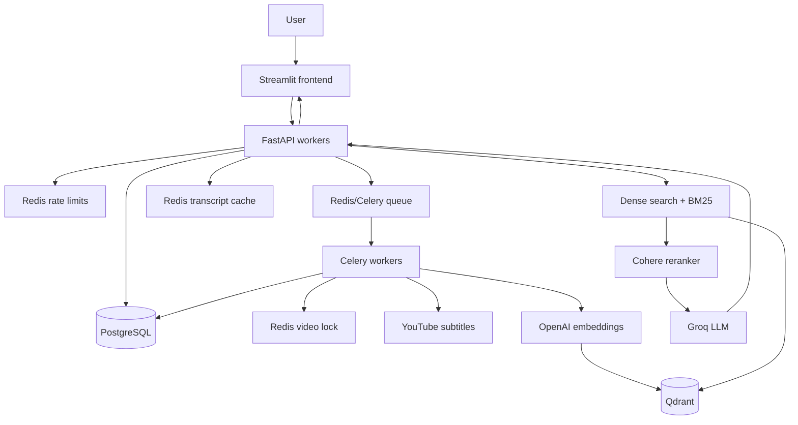

# YouTube RAG Chatbot

Chat with a YouTube video using Retrieval-Augmented Generation (RAG).

The application downloads a video's English subtitles, creates searchable
transcript chunks, combines dense and sparse retrieval, reranks the results,
and generates grounded answers or structured summaries. Its backend is designed
to support concurrent users through FastAPI workers, PostgreSQL, Redis, Celery,
and a shared Qdrant collection.

## Features

- Load a YouTube URL or video ID.
- Ask contextual questions about a video.
- Generate timeline, section, paragraph, bullet, or note-style summaries.
- Include timestamps in answers about specific moments.
- Combine Qdrant dense retrieval with BM25 sparse retrieval.
- Rerank merged results using Cohere.
- Maintain isolated conversation history for each user and conversation.
- Process video ingestion asynchronously with Celery.
- Prevent duplicate ingestion with Redis distributed locks.
- Run automated unit and Locust load tests.

## Technology stack

| Layer | Technology |
|---|---|
| Frontend | Streamlit |
| Backend | FastAPI and Uvicorn |
| Task processing | Celery |
| Queue, cache, locks | Redis |
| Persistent state | PostgreSQL and SQLAlchemy |
| Vector database | Qdrant |
| Embeddings | OpenAI embeddings |
| Sparse retrieval | BM25 |
| Reranking | Cohere |
| LLM | Groq |
| Deployment | Docker Compose |
| Load testing | Locust |

## Project architecture



## Application flow

### Video processing flow

1. Streamlit sends the video ID to `POST /init_video`.
2. FastAPI checks the video's persistent status in PostgreSQL.
3. Redis prevents duplicate enqueue operations for the same video.
4. FastAPI submits a Celery task and immediately returns a job status.
5. A Celery worker downloads subtitles with `yt-dlp`.
6. The worker creates overlapping transcript chunks.
7. Chunks are stored in PostgreSQL and cached in Redis for 24 hours.
8. OpenAI embeddings are stored in the shared Qdrant collection.
9. Every vector receives `video_id` metadata for filtered retrieval.
10. PostgreSQL marks the video as `ready`.
11. Streamlit polls `GET /videos/{video_id}/status` until processing finishes.

### Chat flow

1. Streamlit sends `video_id`, `user_id`, `conversation_id`, and the query.
2. Redis applies per-user/IP rate limiting.
3. PostgreSQL confirms that the video is ready.
4. Transcript chunks are read from Redis or PostgreSQL.
5. Redis serializes messages belonging to the same conversation.
6. The router selects question-answering or summary mode.
7. Question answering merges Qdrant dense retrieval with BM25 retrieval.
8. Cohere reranks the merged documents.
9. Groq produces the grounded response.
10. Conversation history is stored in PostgreSQL using
    `user_id:conversation_id:video_id` as its session identity.

## Project structure

```text
youtube_rag/
|-- README.md
|-- requirements.txt             # Runtime dependencies
|-- requirements-dev.txt         # Runtime dependencies plus Locust
|-- .env                          # Local secrets; never commit
|-- .env.example                  # Configuration template
|-- .gitignore
|-- .dockerignore
|-- docker-compose.yml            # All application services
|-- Dockerfile.backend
|-- Dockerfile.frontend
|-- main.py                       # Backend entry point
|-- src/
|   |-- agent/
|   |   |-- agent.py              # Video jobs, status, and chat lifecycle
|   |   |-- executor.py           # Routing and summarization
|   |   |-- memory.py             # PostgreSQL conversation memory
|   |   `-- state.py              # Persistent state and transcript cache
|   |-- tools/
|   |   |-- transcript.py         # Subtitle extraction and chunking
|   |   |-- search.py             # Hybrid retrieval and reranking
|   |   `-- tasks.py              # Celery ingestion task
|   |-- models/
|   |   |-- llm_client.py         # Groq client
|   |   |-- embeddings.py         # OpenAI and Qdrant clients
|   |   |-- database.py           # SQLAlchemy engine and transactions
|   |   `-- entities.py           # Video and transcript database tables
|   |-- prompts/
|   |   |-- system_prompts.py
|   |   `-- agent_prompts.py
|   |-- utils/
|   |   |-- config.py             # Environment configuration
|   |   |-- redis_client.py       # Cache, locks, and rate limiting
|   |   |-- logger.py
|   |   `-- helpers.py
|   |-- api/
|   |   |-- app.py                # FastAPI application
|   |   |-- routes.py             # HTTP endpoints
|   |   `-- schemas.py            # Request and response validation
|   |-- worker.py                 # Celery configuration
|   `-- frontend.py               # Streamlit interface
|-- tests/
|   |-- test_agent.py
|   |-- test_api.py
|   |-- test_tools.py
|   `-- locustfile.py             # Concurrent-user simulation
|-- data/
|   |-- examples.json
|   `-- knowledge_base/           # Local transcript artifacts
`-- logs/
    `-- load-tests/               # Locust CSV reports
```

## Environment configuration

Create `.env` from the template:

```powershell
Copy-Item .env.example .env
```

At minimum, provide:

```dotenv
QDRANT_URL=https://your-qdrant-instance.example.com
QDRANT_API_KEY=replace-me
GROQ_API_KEY=replace-me
COHERE_API_KEY=replace-me
OPENAI_API_KEY=replace-me
```

Important configuration:

| Variable | Default | Purpose |
|---|---|---|
| `DATABASE_URL` | PostgreSQL at `localhost:5433` | Persistent state and memory |
| `REDIS_URL` | `redis://localhost:6379/0` | Cache, locks, and rate limits |
| `CELERY_BROKER_URL` | `redis://localhost:6379/1` | Background task queue |
| `QDRANT_COLLECTION` | `youtube_transcripts` | Shared vector collection |
| `RATE_LIMIT_PER_MINUTE` | `60` | Per-user/IP request protection |
| `MAX_VIDEO_DURATION_SECONDS` | `14400` | Video duration limit |
| `BACKEND_WORKERS` | `4` | Production API workers |
| `API_ACCESS_KEY` | unset | Optional backend authentication |

Never commit `.env`. Revoke and replace any API credential that has been
exposed publicly.

## Running the project

### Run everything with Docker

Start Docker Desktop, then execute:

```powershell
docker compose up --build -d
```

Check the services:

```powershell
docker compose ps
```

View backend and worker logs:

```powershell
docker compose logs -f backend worker
```

Application URLs:

- Frontend: <http://localhost:8501>
- API documentation: <http://localhost:9999/docs>
- Health endpoint: <http://localhost:9999/health>
- PostgreSQL: `localhost:5433`
- Redis: `localhost:6379`

Stop services without deleting stored volumes:

```powershell
docker compose down
```

### Run Python services locally with uv

Install dependencies:

```powershell
uv pip install -r requirements.txt
```

Start PostgreSQL and Redis:

```powershell
docker compose up -d postgres redis
```

Run the following commands in three separate terminals.

Terminal 1 — Celery worker on Windows:

```powershell
uv run celery -A src.worker:celery_app worker --loglevel=INFO --pool=solo
```

Terminal 2 — backend:

```powershell
uv run main.py
```

Terminal 3 — frontend:

```powershell
uv run streamlit run src/frontend.py
```

Confirm that the backend is reachable:

```powershell
Invoke-RestMethod http://127.0.0.1:9999/health
```

Expected response:

```json
{"status": "healthy"}
```

## API endpoints

| Method | Endpoint | Purpose |
|---|---|---|
| `GET` | `/health` | Backend liveness check |
| `POST` | `/init_video` | Queue video ingestion |
| `GET` | `/videos/{video_id}/status` | Read ingestion status |
| `POST` | `/chat` | Ask a question or request a summary |

Example chat body:

```json
{
  "video_id": "3dhcmeOTZ_Q",
  "query": "What are the main ideas?",
  "user_id": "user-123",
  "conversation_id": "conversation-456"
}
```

## Concurrent-user handling

The backend is stateless with respect to active video sessions. Any API worker
can handle the next request because shared state lives outside the Python
process.

| Concurrency concern | Solution |
|---|---|
| Multiple API requests | Four Uvicorn workers in the backend container |
| Shared video status | PostgreSQL `videos` table |
| Shared transcript chunks | PostgreSQL `transcript_chunks` table |
| Repeated transcript reads | Redis cache with 24-hour TTL |
| Duplicate enqueue requests | Redis lock keyed by `video_id` |
| Duplicate worker processing | Redis ingestion lock keyed by `video_id` |
| Concurrent messages in one chat | Redis conversation lock |
| Conversation isolation | User, conversation, and video composite key |
| Slow downloads and embeddings | Celery background workers |
| Excessive API traffic | Redis per-user/IP rate limiting |
| Vector separation | Qdrant filter on `metadata.video_id` |

Scale ingestion workers with:

```powershell
docker compose up -d --scale worker=4
```

External Groq, Cohere, OpenAI, and Qdrant limits still apply. Adding API workers
does not increase provider quotas.

## Unit tests

```powershell
uv run python -m unittest discover -v
```

Current result: six tests pass, covering source structure, API validation,
timestamp formatting, and database schema creation.

## Locust load testing

Install development dependencies:

```powershell
uv pip install -r requirements-dev.txt
```

### Status and health scenario

This scenario does not call paid LLM services:

```powershell
$env:LOAD_TEST_VIDEO_ID="3dhcmeOTZ_Q"
$env:LOAD_TEST_ENABLE_CHAT="false"

uv run locust -f tests/locustfile.py `
  --headless `
  --users 20 `
  --spawn-rate 5 `
  --run-time 30s `
  --host http://127.0.0.1:9999 `
  --csv logs/load-tests/status-working
```

### Recorded Locust result

The successful run used 20 concurrent users for approximately 30 seconds. The
test video was confirmed as `ready`.

| Metric | Result |
|---|---:|
| Concurrent users | 20 |
| Total requests | 301 |
| Failed requests | 0 |
| Failure rate | 0% |
| Throughput | 10.60 requests/second |
| Median response time | 8 ms |
| Average response time | 11.32 ms |
| p95 response time | 23 ms |
| p99 response time | 94 ms |
| Maximum response time | 167 ms |

Endpoint breakdown:

| Endpoint | Requests | Average | p95 | Failures |
|---|---:|---:|---:|---:|
| `GET /health` | 24 | 3.51 ms | 7 ms | 0 |
| `GET /videos/{video_id}/status` | 277 | 11.99 ms | 24 ms | 0 |

The first requests reached 140–167 ms while connections and pools warmed up.
Steady-state median latency settled around 8 ms. Throughput was limited by the
Locust user's one-to-three-second wait time, so this was a realistic traffic
test rather than a maximum-throughput saturation test.

The raw result files are located in `logs/load-tests/`:

- `status-working_stats.csv`
- `status-working_stats_history.csv`
- `status-working_failures.csv`
- `status-working_exceptions.csv`

### Chat scenario

Chat testing invokes paid and rate-limited external services. Confirm the video
is `ready`, then start with one user:

```powershell
$env:LOAD_TEST_ENABLE_CHAT="true"

uv run locust -f tests/locustfile.py `
  --headless `
  --users 1 `
  --spawn-rate 1 `
  --run-time 20s `
  --host http://127.0.0.1:9999 `
  --csv logs/load-tests/chat
```

Locust exits unsuccessfully when the aggregate failure ratio exceeds 1% or p95
latency exceeds 10 seconds. Configure these thresholds with
`LOAD_TEST_MAX_FAILURE_RATIO` and `LOAD_TEST_MAX_P95_MS`.

## Conclusion

The status-only Locust workload passed with zero failures and low latency at 20
concurrent users. FastAPI routing, PostgreSQL status reads, and networking
remained stable throughout the run.

This result does not establish maximum system capacity because simulated users
waited between requests, and it does not measure the expensive chat path through
Qdrant, BM25, Cohere, Groq, and PostgreSQL conversation memory. The next step is
a controlled chat test followed by stepped user-count tests while monitoring
API latency, database pool usage, Redis latency, Celery queue depth, Qdrant
search time, provider rate-limit responses, and token consumption.

## Author

Samay Jain, IIT Roorkee
